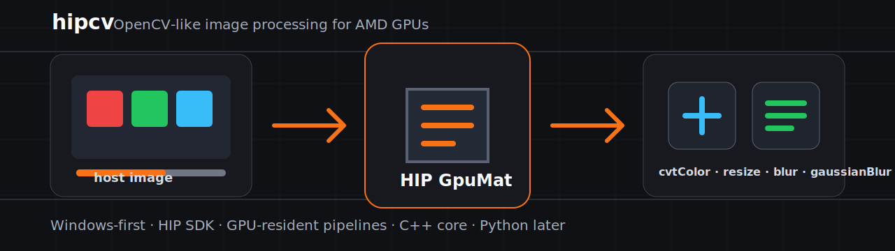

<p align="center">
  
</p>

<h1 align="center">hipcv</h1>

<p align="center">
  <strong>OpenCV CUDA-like image processing for AMD GPUs, starting with Windows and AMD HIP SDK.</strong>
</p>

<p align="center">
  <a href="docs/roadmap.md"></a>
  <a href="https://github.com/eminyilmz/hipCv/actions/workflows/no-hip.yml"></a>
  
  
  
  
</p>

`hipcv` is a higher-level image processing library built on AMD HIP. It aims
to make AMD GPU image processing feel familiar to developers who already use
OpenCV CUDA's `GpuMat` and `cv::cuda` workflow.

The project is intentionally focused: prove a small, reliable, GPU-resident
pipeline on Windows first, then expand the API.

```text
host image -> upload -> cvtColor -> resize -> threshold/blur -> download
```

## Why hipcv?

NVIDIA users have a direct path for GPU image processing with OpenCV CUDA:

```cpp
cv::cuda::GpuMat gpu;
cv::cuda::resize(src, dst, size);
cv::cuda::cvtColor(src, dst, code);
```

AMD developers have powerful building blocks such as HIP SDK, ROCm, RPP,
rocAL, and MIVisionX. The missing layer is a small, practical API that feels
like everyday OpenCV-style application development.

`hipcv` focuses on that layer:

- GPU-resident image buffers.
- Simple upload, download, and copy flow.
- OpenCV-like image operation names.
- Windows-first developer setup.
- C++ core first, Python bindings later.
- Clear tests and benchmarks before expanding scope.

## What This Project Is Not

- Not a CUDA clone.
- Not a replacement for HIP or ROCm.
- Not a full OpenCV replacement.
- Not a DNN inference framework.
- Not a promise that every Linux ROCm component exists on Windows.

## Target API Direction

The long-term Python experience should feel this direct:

```python
import hipcv as hcv

gpu = hcv.upload(img)
gray = hcv.cvtColor(gpu, hcv.COLOR_BGR2GRAY)
small = hcv.resize(gray, (640, 360))
out = small.download()
```

The C++ core comes first:

```cpp
#include "hipcv/hipcv.hpp"

hipcv::GpuMat gpu;
hipcv::ImageShape shape{
    .width = 1920,
    .height = 1080,
    .channels = 3,
    .format = hipcv::PixelFormat::bgr8,
};

auto status = gpu.upload(host_pixels, shape);
if (!status.ok()) {
    // handle status.message()
}
```

## Current Status

`hipcv` is in the early MVP stage.

Implemented or scaffolded:

- Windows-first CMake project.
- Optional HIP SDK detection.
- No-HIP build mode for contributors without AMD GPU hardware.
- `hipcv::Status` and `StatusCode`.
- `hipcv::DeviceQuery`.
- Move-only RAII `hipcv::GpuMat`.
- `GpuMat::allocate`.
- `GpuMat::upload`.
- `GpuMat::download`.
- `GpuMat::copyTo`.
- `cvtColor` with `BGR2GRAY`, `RGB2GRAY`, `BGR2RGB`, and `RGB2BGR`.
- `resize` with nearest-neighbor and bilinear interpolation.
- `threshold` with binary and binary-inverse modes for `gray8`.
- `blur` with box filtering for `gray8`.
- `gaussianBlur` with 3x3 and 5x5 kernels for `gray8`.
- First HIPRTC-backed image kernel.
- Windows smoke example.
- Minimal `cvtColor` example.
- Minimal `resize` example.
- Minimal `threshold` example.
- Minimal `blur` example.
- Minimal `gaussianBlur` example.
- Chained preprocessing pipeline example.
- Basic preprocessing benchmark executable.
- Supported operation matrix.
- API design notes.
- OpenCV CUDA migration notes.
- GPU `GpuMat` roundtrip, copy, and move-semantics tests.
- No-HIP Windows GitHub Actions workflow.

Next technical target:

```text
multi-channel blur support
```

## Quickstart

Start by checking the local Windows environment:

```powershell
.\scripts\check-windows-env.ps1
```

For a machine where AMD HIP SDK is expected to be available:

```powershell
.\scripts\check-windows-env.ps1 -RequireHip
```

### No-HIP Build

Use this path for documentation work, API review, and basic compile checks on
machines without AMD HIP SDK.

```powershell
cmake --preset windows-vs2022-no-hip
cmake --build --preset windows-vs2022-no-hip-release
ctest --preset windows-vs2022-no-hip-release
```

### HIP Build

Use this path on a Windows machine with AMD HIP SDK installed.

First verify the SDK:

```powershell
hipInfo
hipconfig
```

Then build:

```powershell
cmake --preset windows-vs2022
cmake --build --preset windows-vs2022-release
ctest --preset windows-vs2022-release
```

Useful HIP sample executables after building:

```powershell
.\build\windows-vs2022\Release\hipcv_preprocess_pipeline.exe
.\build\windows-vs2022\Release\hipcv_preprocess_benchmark.exe
```

## Initial Target Platform

| Area | Target |
| --- | --- |
| OS | Windows 11 x86-64 |
| GPU backend | AMD HIP SDK for Windows |
| GPU | ROCm/HIP-supported AMD Radeon or Radeon PRO |
| Toolchain | Visual Studio 2022/2026 or compatible C++ build tools |
| Build system | CMake |
| Language | C++17 |
| Future binding | Python 3.10+ |

Linux ROCm support is still relevant, but it is not the first milestone.

## MVP Roadmap

| Milestone | Focus | Output |
| --- | --- | --- |
| `v0.1` | Technical scaffold | CMake, HIP detection, `GpuMat`, upload/download/copy |
| `v0.2` | First kernel | `BGR2GRAY`, `RGB2GRAY`, `BGR2RGB`, `RGB2BGR`, CPU reference tests |
| `v0.3` | Preprocessing MVP | `resize`, `threshold`, chained GPU pipeline |
| `v0.4` | Usability | examples, docs, no-HIP CI checks, optional OpenCV comparison |
| `v0.5` | Python preview | pybind11, NumPy upload/download, Python examples |

See the full [roadmap](docs/roadmap.md) for detailed phases, deliverables, and
exit criteria.

## Available CMake Presets

| Preset | Purpose |
| --- | --- |
| `windows-vs2022` | Visual Studio 2022 with HIP enabled |
| `windows-vs2022-no-hip` | Visual Studio 2022 without HIP |
| `windows-vs2026` | Visual Studio 2026 with HIP enabled |
| `windows-vs2026-no-hip` | Visual Studio 2026 without HIP |
| `windows-ci-no-hip` | NMake/MSVC no-HIP preset for GitHub Actions |

## Documentation

- [Roadmap](docs/roadmap.md)
- [Supported operations](docs/supported-operations.md)
- [API design notes](docs/api-design.md)
- [OpenCV CUDA migration notes](docs/opencv-cuda-migration.md)
- [Windows development notes](docs/windows-development.md)
- [Market positioning](docs/market-positioning.md)
- [Validation log](docs/validation-log.md)

## Design Principles

- Keep Windows as the first-class path.
- Keep platform-specific details out of the public API.
- Return explicit `Status` values in the MVP.
- Keep the C++ core small before adding Python.
- Add benchmarks that separate transfer cost from GPU compute cost.
- Avoid broad OpenCV compatibility claims until the core operations are proven.

## Repository Layout

```text
cmake/       CMake helper modules
docs/        planning, positioning, and setup notes
examples/    small runnable examples
include/     public hipcv headers
scripts/     local developer helper scripts
src/         C++ implementation
tests/       planned test executables
benchmarks/  planned benchmark tools
python/      future Python binding
```

## Project Stage

This repository is experimental and pre-release. The immediate goal is not a
large API surface; it is a trustworthy first path from host memory to AMD GPU
processing and back.
